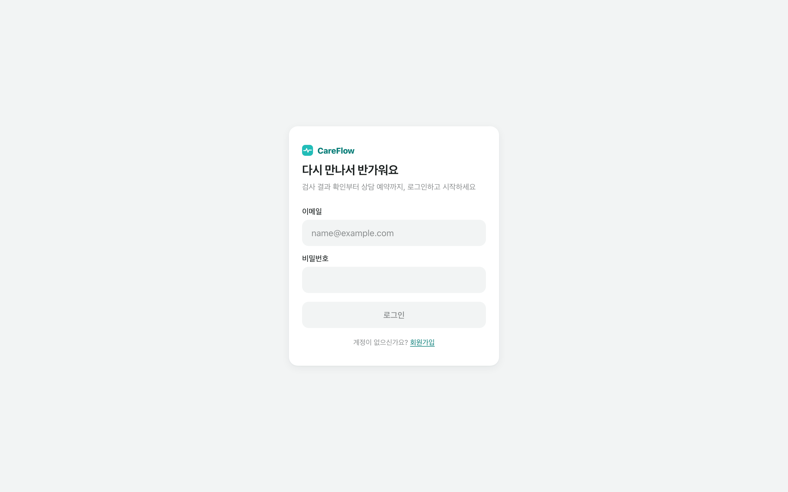
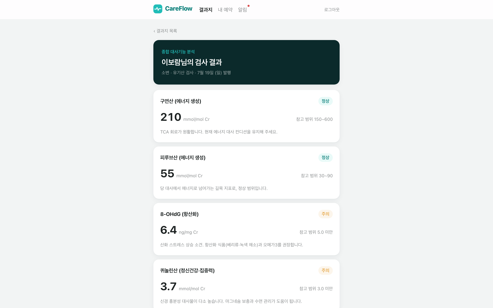
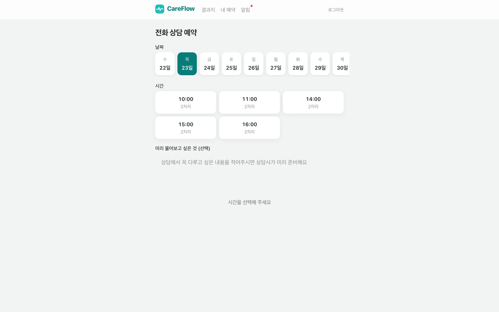
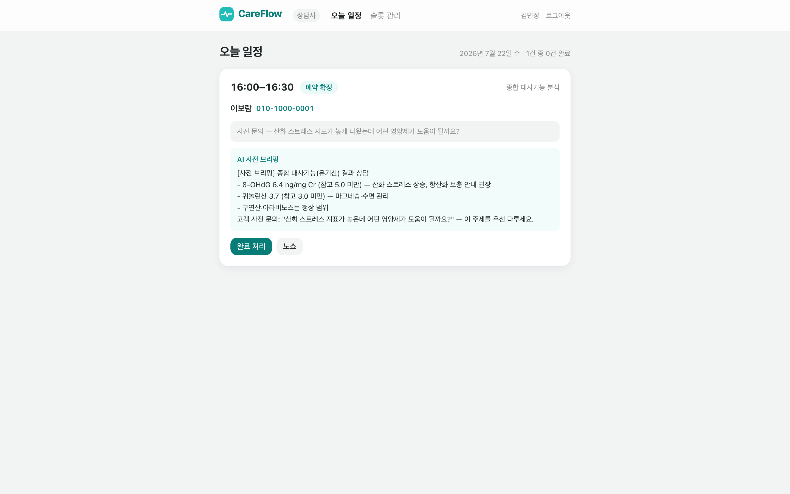
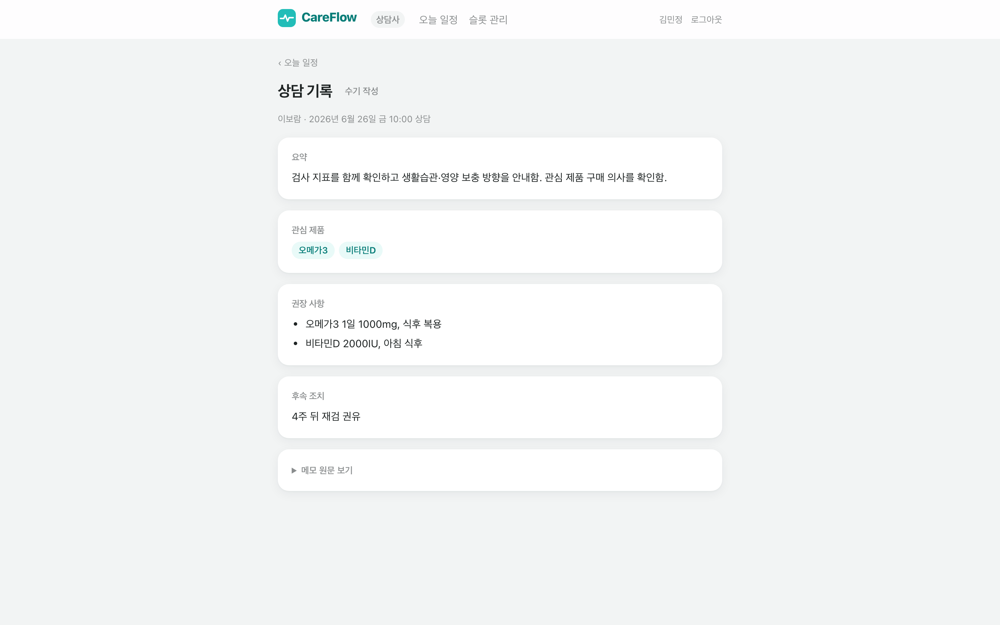
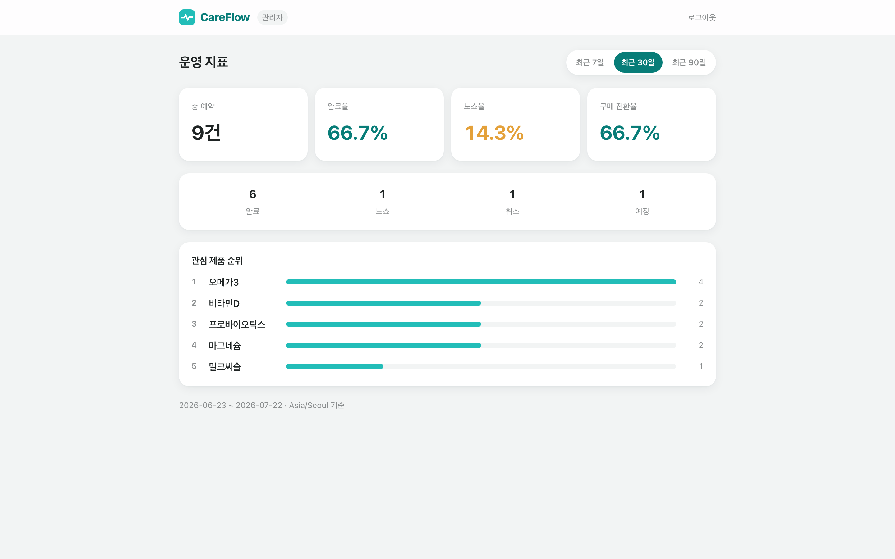
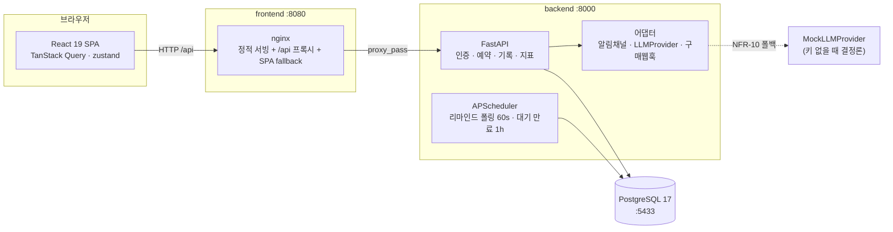
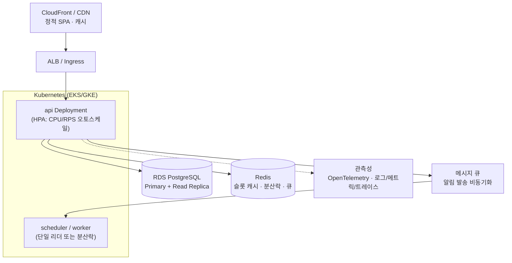

# CareFlow — 검사 결과 기반 건강상담 운영 플랫폼

> 대사체 분석 결과지를 받은 고객의 **1:1 전화 상담 운영**(예약 → 리마인드 → 상담 → 기록 → 지표)을 자동화하는 풀스택 MVP.
> 가상 헬스케어 기업 "바이오컴" 시나리오 기반 설계·구현 과제.

**한 줄 요약** — 사람이 채널로 문의해 담당자가 수기로 잡던 상담 예약을, *결과지에서 바로 예약 → 자동 리마인드 → 구조화된 상담 기록 → 전환율 지표*로 이어지는 하나의 운영 흐름으로 만들었습니다. 이중 예약·노쇼·데이터 유실이라는 3대 근본 문제를 각각 **DB 제약 / 상태 전이 가드 / 웹훅 기반 어트리뷰션**으로 해결하고, 그 결정을 전부 테스트로 증명했습니다.

<p align="center">
  
</p>

---

## 30초 실행

API 키도, 외부 계정도 필요 없습니다. Docker만 있으면 됩니다.

```bash
docker compose up --build
```

3개 서비스(PostgreSQL + FastAPI + nginx)가 뜨고, 백엔드가 **마이그레이션 → 시드 → 서버**를 자동 수행합니다. 시드는 멱등이라 재기동해도 안전합니다.

| 진입점 | URL |
| --- | --- |
| **웹 앱 (브라우저 진입점)** | http://localhost:8080 |
| API 문서 (Swagger) | http://localhost:8000/docs |

**데모 계정** (비밀번호 전부 `demo1234`):

| 역할 | 이메일 | 화면 |
| --- | --- | --- |
| 고객 | `customer1@careflow.kr` | 결과지 → 지표 판정 → 상담 예약 → 내 예약/알림함 |
| 상담사 | `counselor1@careflow.kr` | 오늘 일정(AI 브리핑) → 상담 기록(AI 구조화) → 슬롯 관리 |
| 관리자 | `admin@careflow.kr` | 완료율·노쇼율·전환율·관심 제품 순위 대시보드 |

> LLM(상담 기록 구조화·브리핑)은 `ANTHROPIC_API_KEY`가 없으면 **결정론 MockProvider로 자동 폴백**합니다. 키 없이도 전 기능이 재현됩니다. 실제 키를 쓰려면 `backend` 서비스에 환경변수만 주입하면 됩니다.

---

## 무엇을, 왜 만들었나

과제의 문제 상황을 뜯어보면 상담 "행위"가 아니라 상담 **"운영"**이 병목입니다. 근본 문제를 셋으로 정리하고, 각각을 정면으로 해결했습니다.

| 근본 문제 | 현재 (수기 운영) | CareFlow의 해결 | 어떻게 증명했나 |
| --- | --- | --- | --- |
| **① 예약이 사람을 거친다** | 고객이 채널로 문의 → 담당자가 시간 확인 후 재안내. 일정 겹침·누락 발생 | 결과지에서 바로 셀프 예약. 슬롯 조회·확정을 시스템이 처리 | 동시 예약 2건 → **DB 제약**으로 1건만 성공 (동시성 테스트) |
| **② 상태가 관리되지 않는다** | 예약해도 당일 연락 두절 → 상담 미진행(노쇼) | 확정 → 24h/1h 리마인드 자동 발송, 상태 전이를 서버가 강제 | 잘못된 전이(미시작 예약 완료 등) **가드로 차단** (상태 전이 테스트) |
| **③ 데이터로 남지 않는다** | 기록 방식 제각각, 전환율 수동 집계 | 상담 기록을 스키마로 구조화, 구매 웹훅으로 전환 자동 귀속 | 웹훅 재전송 시 **order_id 멱등**으로 중복 집계 차단 (멱등성 테스트) |

부가로, 과제가 짚은 두 엣지 케이스도 설계에 반영했습니다.

- **가족 대리 상담** — 고객은 본인(Subject)과 가족을 함께 소유. 예약·기록에 피검자 스냅샷을 남기고, QR 진입 시 이름+전화 본인확인으로 사칭을 차단.
- **원하는 시간대 만석** — 만석이면 이탈시키지 않고 **대안 슬롯을 UI로 제시**. 노쇼는 고객 화면에서 "상담 미진행"으로 순화하고 재예약 CTA를 노출.

> 상세 근거는 산출물 문서(`docs/01~03`)에 FR/NFR ID와 함께 기록돼 있습니다. 아래 [산출물 매핑](#제출-산출물-6종-매핑)을 참고하세요.

---

## Golden Path — 3분 데모 시나리오

브라우저에서 http://localhost:8080 으로 접속해 아래 순서로 따라가면 전체 운영 흐름을 한 번에 볼 수 있습니다.

### 1. 고객 — 결과지에서 상담까지 (`customer1@careflow.kr`)
1. 로그인 → **결과지 목록**. 종합 대사기능·영양 중금속 등 실제 검사 스펙 기반 결과지가 보입니다.
2. 결과지 상세 → 지표별 **정상/주의 판정 칩**(범위 해석) 확인 → "상담 예약하기" CTA.
3. 원하는 날짜·시간 슬롯 선택 → 예약 확정. **만석 날짜를 골라 대안 슬롯 UI**도 확인해 보세요.
4. **내 예약**에서 방금 예약 확인, **알림함**에 확정 + 24h 리마인더 도착.

| 결과지 상세 — 지표 판정 | 전화 상담 예약 |
| --- | --- |
|  |  |

### 2. 상담사 — 브리핑 보고 기록까지 (`counselor1@careflow.kr`)
1. **오늘 일정**에 배정된 상담과 **고객 연락처(tel: 링크)**, AI 브리핑(비식별) 인라인 표시.
2. 상담 후 완료 처리 → **상담 기록** 작성. 메모를 붙이면 **AI가 구조화 초안**을 생성, 상담사가 검수·수정 후 저장(실패 시 수기 경로).
3. **슬롯 관리**에서 30분 그리드 토글로 가용 시간 편집(예약된 슬롯은 잠금).

| 오늘 일정 — AI 브리핑 + 고객 연락처 | 구조화된 상담 기록 |
| --- | --- |
|  |  |

### 3. 관리자 — 지표 확인 (`admin@careflow.kr`)
- **완료율 / 노쇼율 / 전환율** 카드 + 상태 분해 + **관심 제품 순위** 막대 + 기간 토글(7/30/90일).
- 시드에 과거 상담 이력(완료·노쇼·취소)과 구매 어트리뷰션이 들어 있어 지표가 실측값으로 채워집니다.



---

## 아키텍처 (현재 구현)

`docker compose up` 한 번으로 뜨는 3-서비스 구성입니다.



**설계 원칙 세 가지가 코드 전반을 관통합니다.**

- **외부 연동은 어댑터 뒤에만** — 알림 채널(인앱 → 알림톡/SMS 교체 가능), LLM(Anthropic ↔ Mock), 구매 이벤트가 모두 인터페이스 뒤에 있어 실채널로 갈아끼우기만 하면 됩니다.
- **LLM은 항상 보조** — 기록 구조화·브리핑이 실패해도 예약/상담/기록의 핵심 플로우는 동작합니다 (NFR-3).
- **시간은 UTC 저장 / Asia-Seoul 해석** — DB는 `timestamptz`, 표시·경계 판정은 서울 고정 (NFR-8).

---

## 핵심 설계 결정 (테스트로 증명한 것)

과제가 "설계 근거를 명시하라"고 요구했기에, **말이 아니라 실행되는 테스트로** 결정을 방어했습니다. 백엔드 테스트 스위트가 각 결정의 반례를 실증합니다.

### 1. 이중 예약 차단은 앱 로직이 아니라 DB 제약으로 (NFR-1)
동시에 같은 슬롯에 두 요청이 들어와도 앱 레벨 `if` 검사는 경합에서 새어나갑니다. 그래서 **partial unique index + exclusion constraint**로 DB가 강제합니다.

- `uq_confirmed_reservation_per_test_result` — 결과지당 confirmed 예약 1개 (가족 사칭·스팸 예약 방지)
- `ex_reservations_customer_time_overlap` — 같은 고객 시간대 겹침 배제
- 슬롯당 active 예약 1개

→ 동시성 테스트가 병렬 요청 2건 중 1건만 통과함을 증명합니다.

### 2. 상태 전이는 서버가 강제 (FSM 가드)
`대기 → 확정 → 완료/노쇼/취소`의 유효 전이만 허용합니다. "시작 시각도 안 된 예약을 완료 처리" 같은 잘못된 전이는 가드가 거부 → 상태가 언제나 신뢰 가능한 진실입니다.

### 3. 접근 제어 — 역할 가드 + QR 스코프 세션
- 로그인 세션은 역할(customer/counselor/admin)로 라우트를 가르고, 리소스는 owner 체크로 격리.
- **QR 딥링크 진입**은 서명 토큰(위변조 시 400, 본인확인 실패 시 403) → 허용된 3개 API 외 일괄 차단하는 **스코프 세션**을 발급. 로그인 없이 예약만 가능한 안전한 경로.

### 4. 전환 어트리뷰션 — 웹훅이 진실의 원천
구매 전환은 클라이언트 추적(GA/GTM)으로는 유실됩니다. 그래서 **구매 웹훅(HMAC 서명 검증)**을 source of truth로 두고, `order_id` 멱등 + `completed_at` 기준 30일 윈도우로 상담↔구매를 귀속. 재전송해도 중복 집계되지 않습니다.

---

## 확장·운영 설계 (설계만 — 구현 범위 밖)

> **이 섹션은 의도적으로 구현하지 않았습니다.** 과제 스코프는 상담 운영 MVP이고, K8s·CI/CD·대용량 처리를 억지로 코드에 욱여넣는 것보다 **스코프를 명확히 한정한 판단**이 더 정직하다고 봤습니다. 대신 실서비스로 갈 때의 아키텍처와 병목 대응을 설계로 증명합니다.

### 클라우드 아키텍처 (프로덕션 구상)



### 예상 병목과 대응

| 병목 지점 | 현재 (MVP) | 부하가 커지면 | 대응 |
| --- | --- | --- | --- |
| **슬롯 조회** | 매 요청 DB 쿼리 | 인기 시간대에 조회 폭주 (읽기 편중) | Redis 캐시(짧은 TTL) + Read Replica로 읽기 오프로드. 쓰기(예약 확정)는 여전히 Primary의 DB 제약으로 정합성 보장 |
| **리마인드 폴링** | APScheduler 60초 폴링, 단일 프로세스 | 인스턴스 다중화 시 중복 발송 위험 | 폴링 → **큐 기반 스케줄드 잡**으로 전환. 워커 다중화 + 분산락(리더 선출)으로 정확히 한 번 발송 |
| **알림 발송** | 동기 어댑터 호출 | 외부 채널(알림톡) 지연이 요청을 물고 늘어짐 | 메시지 큐로 **비동기화** + 실패 재시도/DLQ. 어댑터 인터페이스는 그대로라 교체 비용 낮음 |
| **DB 쓰기 경합** | 단일 Primary + 제약 | 슬롯 핫스팟 | 제약은 유지(정합성 타협 불가), 슬롯 파티셔닝·큐잉으로 경합 완화 |

### 운영 관점 (설계 반영됨)
- **원커맨드 재현성**(NFR-6·10)은 그대로 CI 파이프라인의 통합 테스트 스테이지로 이어집니다: `compose up` → 시드 → 테스트.
- **관측성** — 상태 전이·웹훅·알림 발송은 이벤트로 남길 지점이 이미 어댑터 경계에 정렬돼 있어, 트레이싱 삽입 지점이 명확합니다.
- **점진적 실채널 전환** — 인앱 알림 → 알림톡/SMS는 `NotificationChannel` 어댑터 추가만으로 가능(계약 동일).

---

## 기술 스택 & 선택 근거

| 레이어 | 선택 | 근거 |
| --- | --- | --- |
| **프론트** | React 19 + TypeScript + Vite | 과제 요구(React). TanStack Query로 서버 상태, zustand로 인증/스코프 세션 분리. **openapi-typescript 코드젠**으로 백엔드 스키마 → 프론트 타입 드리프트 차단 |
| **백엔드** | **FastAPI** (Python 3.12) | 과제가 `NestJS 또는 FastAPI`를 허용. 스키마-우선(Pydantic) 설계가 **OpenAPI 자동 생성 → 프론트 코드젠**으로 이어져 풀스택 타입 안전을 한 소스로 확보. SQLAlchemy 2.0 + Alembic로 DB 제약을 마이그레이션에 실증 |
| **DB** | PostgreSQL 17 | 이중 예약 차단의 핵심인 **partial unique index / exclusion constraint**를 앱이 아닌 DB가 강제. `timestamptz`로 시간 정합성 |
| **비동기** | APScheduler | 리마인드/만료 폴링. 실서비스 확장 경로(큐)는 위 [확장 설계](#확장운영-설계-설계만--구현-범위-밖) 참조 |
| **LLM** | Anthropic (어댑터 추상화) | 기록 구조화(동기)·브리핑(Message Batches). 키 없으면 **결정론 Mock 폴백**(NFR-10). 항상 보조 수단(NFR-3) |
| **배포** | docker-compose 3-서비스 멀티스테이지 | 원커맨드 재현. nginx가 SPA 서빙 + `/api` 프록시 |

> **FastAPI를 고른 이유(요약)**: NestJS도 가능했지만, 이 과제의 핵심 가치는 *스키마 하나로 백엔드-프론트 타입을 묶는 것*이었습니다. Pydantic → OpenAPI → openapi-typescript 파이프라인이 이걸 가장 짧은 경로로 실현합니다. NestJS로 갈 경우의 이점(DDD 레이어링·엔터프라이즈 구조)은 이 규모에선 오버헤드라 판단했습니다.

---

## 제출 산출물 6종 매핑

과제 3)절이 요구한 6종 산출물을 아래에 매핑합니다.

| # | 요구 산출물 | 위치 |
| --- | --- | --- |
| 1 | 문제 정의 및 요구사항 분석 | [`docs/01-problem-definition.md`](docs/01-problem-definition.md) |
| 2 | 도출한 전체 요구사항 목록 | [`docs/02-requirements.md`](docs/02-requirements.md) (FR/NFR ID 부여) |
| 3 | 구현할 MVP 범위 및 근거 | [`docs/03-mvp-scope.md`](docs/03-mvp-scope.md) (Won't 항목 근거 포함) |
| 4 | 시스템 설계 문서 | [`docs/04-system-design.md`](docs/04-system-design.md) (아키텍처·ERD·API·운영정책) + [`docs/05-design-system.md`](docs/05-design-system.md) + [`docs/06-frontend-design.md`](docs/06-frontend-design.md) |
| 5 | 구현 결과물 | `backend/` · `frontend/` (본 README의 [실행법](#30초-실행)) |
| 6 | README | **이 문서** |

---

## 프로젝트 구조

```
allosta/
├── docs/               # 산출물 1~4 (설계 문서 = single source of truth)
├── backend/            # FastAPI · SQLAlchemy · Alembic · APScheduler
│   ├── app/
│   │   ├── api/        # 라우터 (인증·예약·기록·지표·웹훅·QR)
│   │   ├── models/     # SQLAlchemy 모델 11종
│   │   ├── adapters/   # 알림채널 · LLMProvider · 구매웹훅
│   │   └── ...
│   ├── alembic/        # 마이그레이션 (DB 제약 실증)
│   ├── seed.py         # 멱등 시드 (데모 계정·이력·지표)
│   └── tests/          # 동시성·상태전이·접근제어·멱등성 테스트
├── frontend/           # React 19 · TS · Vite · Tailwind v4
│   ├── src/api/        # openapi-fetch 클라이언트 + 생성 타입(schema.d.ts)
│   ├── src/pages/      # 고객·상담사·관리자 화면
│   └── e2e/            # Playwright E2E 12종
└── docker-compose.yml  # db + backend + frontend 원커맨드
```

## 테스트 실행

```bash
# 백엔드 (동시성·상태전이·접근제어·웹훅 멱등성)
cd backend && uv run pytest

# 프론트 빌드 + 린트
cd frontend && npm run build && npm run lint

# E2E (백엔드 기동 상태에서)
cd frontend && npm run e2e
```

---

## 포트 맵

| 서비스 | 호스트 포트 | 비고 |
| --- | --- | --- |
| 웹 앱 (nginx) | 8080 | **브라우저 진입점** |
| API (FastAPI) | 8000 | `/docs` Swagger |
| DB (PostgreSQL) | 5433 | 로컬 PostgreSQL과 충돌 회피용 |
