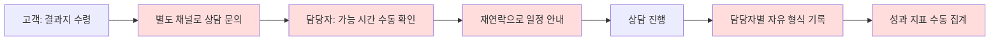

# 1. 문제 정의 및 요구사항 분석

## 1.1 배경

바이오컴은 대사체 분석 기반 AI 헬스케어 기업으로, 고객이 분석 키트 구매 → 검체 제출 → 수 주 내 맞춤형 건강 분석 결과지 수령의 흐름으로 서비스를 제공한다. 결과지를 받은 고객은 수치의 의미, 주의사항, 식품/영양제 추천 등을 **전문 상담사와의 1:1 전화 상담**으로 안내받는데, 이 상담 운영 전 과정이 수동으로 이루어지고 있다.

## 1.2 현재 프로세스와 문제점

문제 상황 서술에서 도출한 페인포인트를 이해관계자별로 분해하면 다음과 같다.

### 고객 관점

| # | 페인포인트 | 원문 근거 |
|---|-----------|----------|
| P1 | 상담 예약을 위해 별도 채널로 먼저 연락하고, 담당자의 재안내를 기다려야 함 | "별도 채널로 먼저 연락을 취해야 하고, 담당자가 가능한 시간을 확인하여 다시 안내" |
| P2 | 본인이 아닌 **가족의 검사 결과**에 대해 상담받고 싶은데 방법이 마땅치 않음 | "본인이 아닌 가족의 검사 결과에 대해 상담을 받고 싶어하는 경우" |
| P3 | 원하는 시간대가 꽉 차 있으면 **대안 없이 이탈** | "원하는 시간대에 상담이 이미 꽉 차 있을 경우 별다른 대안을 찾지 못하고 이탈" |

### 운영(담당자) 관점

| # | 페인포인트 | 원문 근거 |
|---|-----------|----------|
| P4 | 일정 겹침, 예약 누락이 수시로 발생 | "일정이 겹치거나 예약이 누락되는 일이 종종 발생" |
| P5 | 예약 완료 후 **당일 노쇼**(연락 두절)로 상담 불발 | "상담 당일 고객과 연락이 닿지 않아 상담이 진행되지 못하는 경우" |

### 상담사 관점

| # | 페인포인트 | 원문 근거 |
|---|-----------|----------|
| P6 | 상담 기록 체계가 없어 **담당자마다 기록 방식이 다름** | "일관된 방식으로 기록하는 체계가 없어 담당자마다 기록 방식이 다릅니다" |
| P7 | 관심 제품, 구매 전환 여부 등 **성과 데이터가 쌓이지 않음** | "상담의 성과를 파악할 수 있는 데이터가 체계적으로 쌓이지 않아" |

### 비즈니스 관점

| # | 페인포인트 | 원문 근거 |
|---|-----------|----------|
| P8 | 상담 전환율 등 지표를 **수동 집계** | "상담 전환율 같은 지표는 지금도 수동으로 집계" |
| P9 | 데이터 부재로 **서비스 개선이 어려움** | "서비스를 개선하기 어렵고" |

## 1.3 문제의 본질 정의

위 페인포인트는 세 개의 근본 문제로 수렴한다.

1. **예약이 시스템이 아니라 사람을 거친다.**
   P1, P3, P4는 모두 "가용 시간이 시스템에 없고 담당자의 머릿속/수기 장부에 있다"는 단일 원인에서 나온다. → 상담사의 가용 시간을 시스템이 관리하고, 고객이 이를 직접 조회·예약하는 **셀프서비스 예약**으로 해결한다.

2. **상담 라이프사이클에 상태 관리가 없다.**
   P5(노쇼)는 예약 이후 상담 완료까지의 상태(확정 → 리마인드 → 진행 → 완료/노쇼)를 아무도 추적하지 않기 때문에 발생한다. → 예약을 **상태 기계**로 관리하고, 상태 전이에 맞춰 **자동 알림**을 발송한다.

3. **상담이 데이터로 남지 않는다.**
   P6~P9는 상담 결과가 비정형(자유 서술)으로 흩어져 있어 집계가 불가능한 문제다. → 상담 기록을 **구조화된 스키마**(관심 제품, 추천 사항, 구매 전환 여부 등)로 저장하고, 지표를 **자동 집계**한다. 상담사의 기록 부담을 낮추기 위해 자유 메모를 LLM으로 구조화하는 보조 기능을 결합한다.

> **설계 원칙 — 대체가 아닌 증강.** 지문에서 상담 자체는 문제가 아니라 가치로 서술된다("전문가로부터 직접 안내받고 싶어합니다"). 문제는 상담이 아니라 상담을 둘러싼 **운영**이다("문제는 이 상담 과정이 여전히 수동으로 운영되고 있다는 점"). 따라서 본 설계는 상담(전문가의 가치 전달)은 그대로 두고 상담 전후의 운영 오버헤드만 자동화한다. LLM은 상담사를 대체하지 않으며 준비(사전 브리핑)·기록(구조화) 부담을 줄이는 보조 수단으로만 사용하고, 모든 LLM 산출물은 상담사 검수 후 확정한다. 상담사는 이 비즈니스에서 비용이 아니라 구매 전환을 만드는 **매출 채널**이다.

## 1.4 이해관계자(액터) 정의

| 액터 | 설명 | 핵심 목표 |
|------|------|----------|
| **고객** | 검사 키트를 구매하고 결과지를 수령한 사용자. 본인 또는 가족(피검자)의 결과에 대해 상담을 원함 | 원하는 시간에 쉽게 예약하고, 만석이면 대안을 안내받는 것 |
| **상담사** | 하루 여러 건의 1:1 전화 상담을 수행하는 전문 인력 | 일정 관리 자동화, 상담 준비 시간 단축, 기록 부담 최소화 |
| **운영 관리자** | 상담 운영 전반과 성과를 관리 | 노쇼율/전환율 등 지표를 실시간으로 파악하고 서비스를 개선하는 것 |

주요 도메인 개념: 계정(고객)과 **피검자(Subject)** 를 분리한다. 검사 결과는 피검자에 귀속되며, 한 계정이 여러 피검자(본인 + 가족)를 관리한다. 이것이 P2(가족 상담)의 구조적 해법이다.

**전제 가정**: 분석 키트는 자사몰에서 구매하므로 **모든 결과지는 계정이 있는 구매자에게 귀속**된다 (키트 구매 시 계정 생성). 따라서 QR 진입·예약·알림은 계정 존재를 전제하며, 비회원 예약은 지원하지 않는다.

## 1.5 성공 기준 (개선 후 기대 지표)

| 문제 | 측정 지표 | 기대 방향 |
|------|----------|----------|
| 예약 수동 운영 (P1, P4) | 예약 1건당 운영자 개입 횟수 | 0회 (결과지 QR 진입 + 완전 셀프서비스) |
| 이중 예약/누락 (P4) | 중복 예약 발생 건수 | 0건 (DB 제약으로 원천 차단) |
| 노쇼 (P5) | 노쇼율 | 자동 리마인더로 감소 + 최초로 **측정 가능**해짐 |
| 만석 이탈 (P3) | 만석 시간대 이탈률 | 인근 빈 슬롯 추천 + 대기 신청(취소 시 알림)으로 회수. 상담사 자동 배정으로 시간대별 공급 자체도 증가 |
| 기록 비표준 (P6) | 구조화 기록 작성률 | 100% (구조화 입력 강제 + LLM 보조) |
| 지표 수동 집계 (P8) | 지표 집계 소요 시간 | 실시간 대시보드로 0분 |
