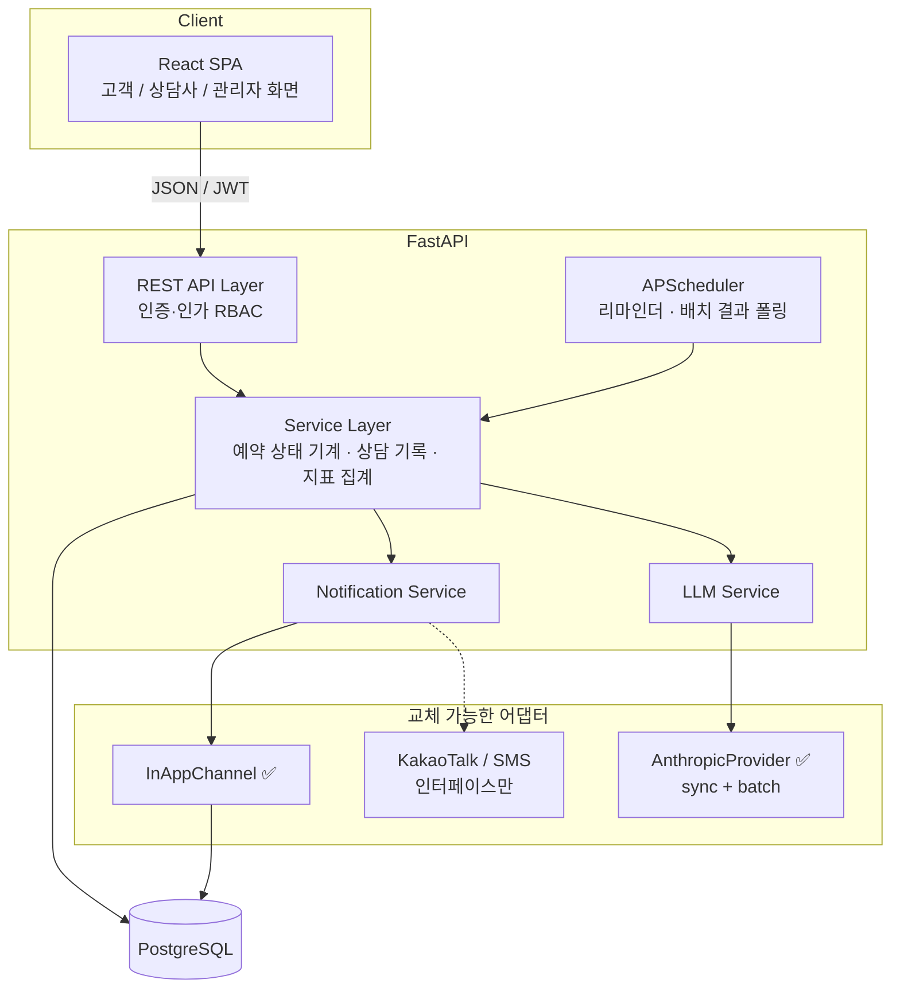
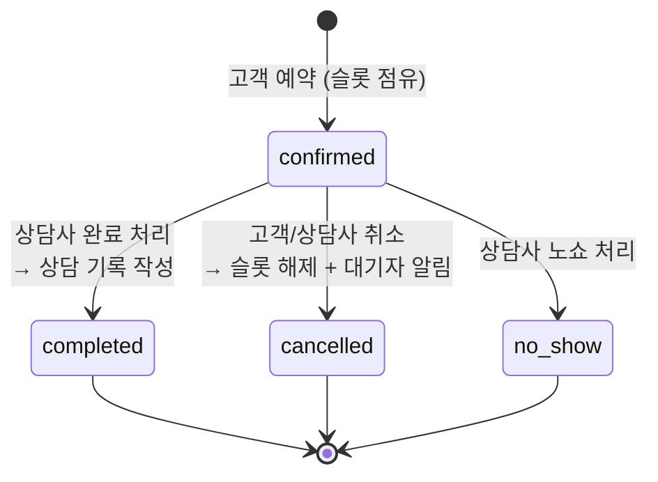
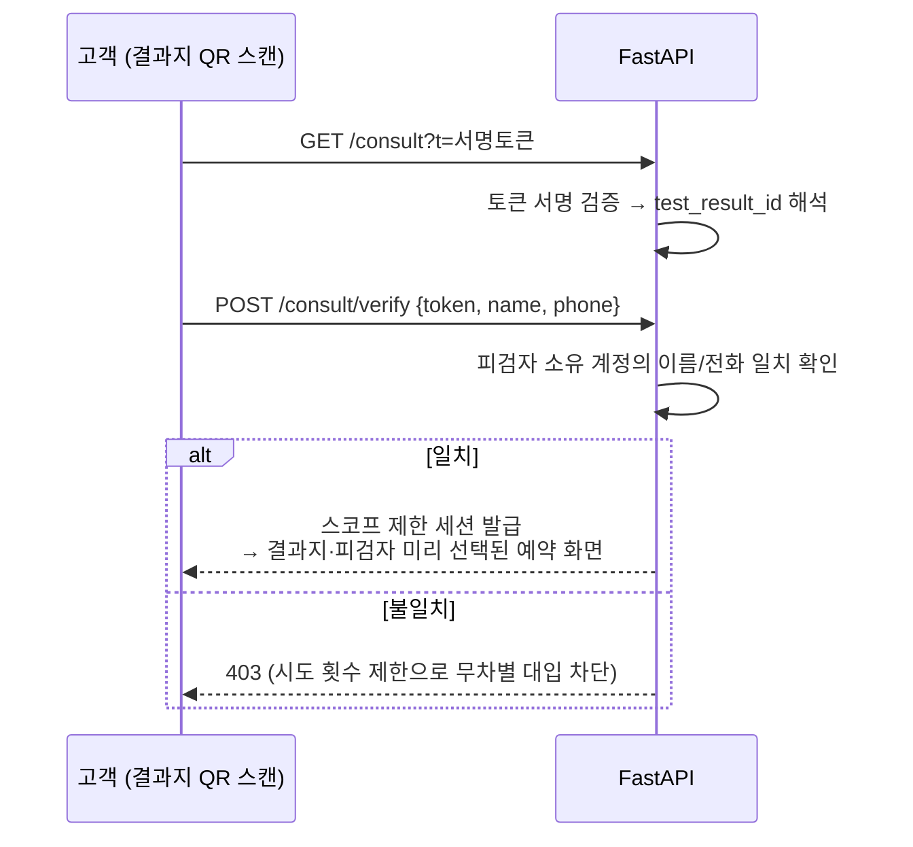
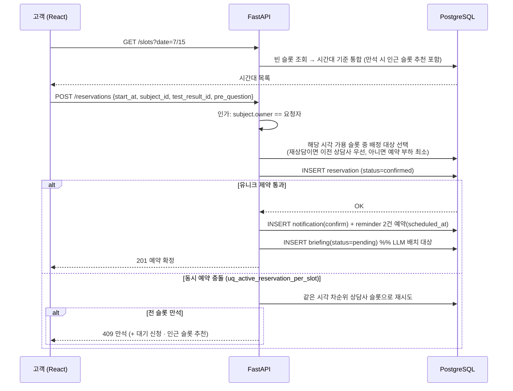
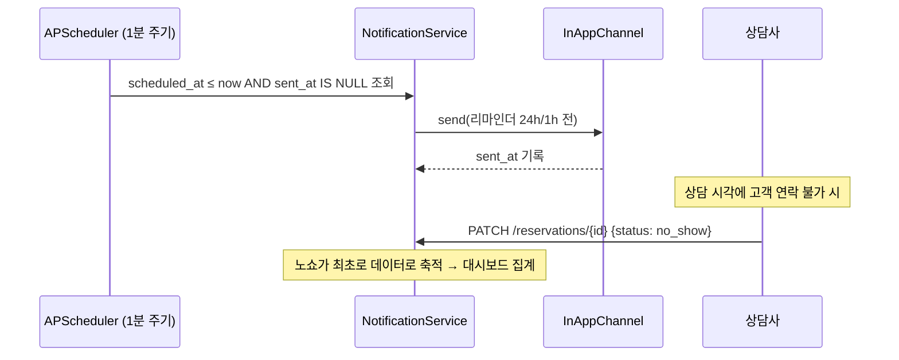
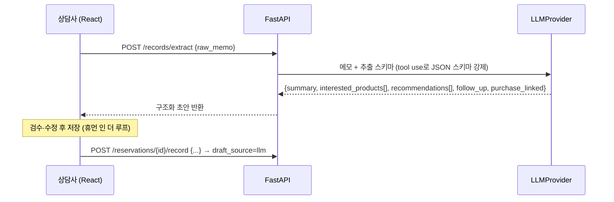
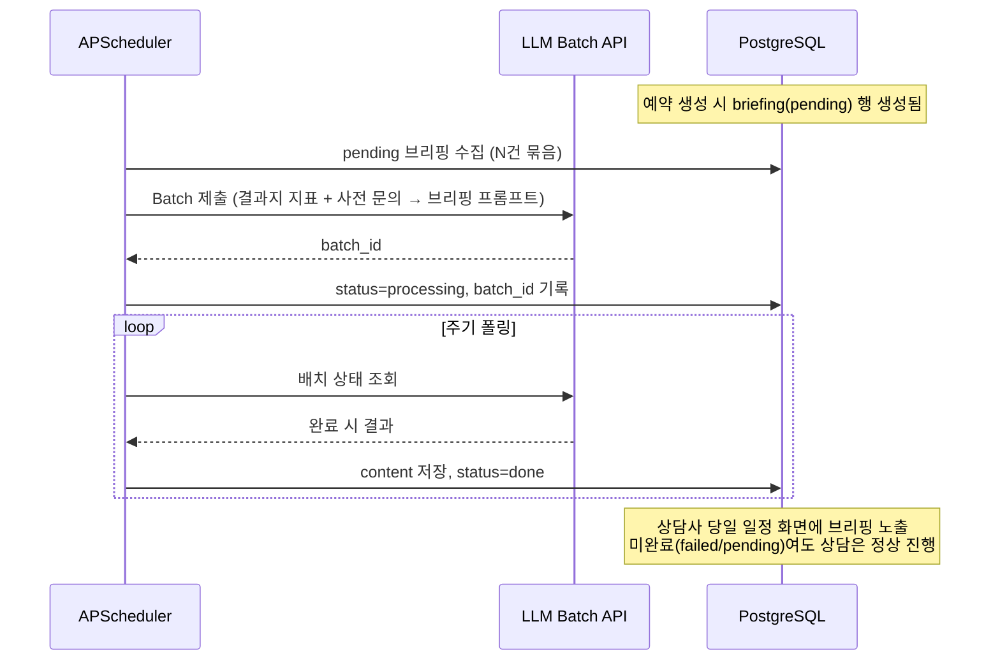
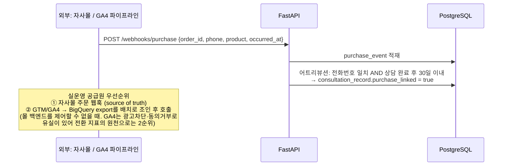

# 4. 시스템 설계 문서

## 4.1 기술 스택 및 선정 근거

| 계층 | 선택 | 근거 |
|------|------|------|
| Frontend | React 18 + TypeScript + Vite | 과제 요구사항(React). TS로 API 계약 타입 안전성 확보 |
| Backend | FastAPI (Python 3.12) | 과제 요구사항 중 택1. LLM 생태계(공식 SDK, structured output)가 Python 중심이고, 비동기 I/O(예약 API + LLM 호출 + 스케줄러)를 단일 런타임에서 처리 가능 |
| ORM / DB | SQLAlchemy 2.0 + **PostgreSQL** | 이중 예약 차단에 필요한 **partial unique index**, 상태 enum, JSONB(결과지 지표) 지원. 개발 편의를 위해 SQLite가 아닌 실제 운영 DB로 처음부터 검증 |
| 마이그레이션 | Alembic | 스키마 변경 이력 추적 (NFR-5의 연장) |
| 스케줄러 | APScheduler (in-process) | 리마인더·배치 폴링용. MVP 트래픽에서 별도 워커(Celery+Redis)는 과설계. 단, 서비스 레이어와 분리해 워커 전환 시 스케줄러 코드만 교체 |
| LLM | Anthropic API (provider 어댑터로 추상화) + **결정론 목 폴백** | structured output(tool use 스키마 강제) + Message Batches API(비용 50% 절감) 지원. `LLMProvider` 인터페이스 뒤에 두어 교체 가능하며, **API 키 부재 시 결정론적 MockProvider로 자동 폴백**해 키 없이도 전 플로우가 동작 (NFR-10) — 키를 넣으면 실 API·Batch까지 동일 코드로 시연 |
| 인증 | JWT (access token) | 3역할 RBAC에 충분. 세션 스토어 불필요 |
| 실행 환경 | Docker Compose | NFR-6 (평가자가 한 명령으로 구동) |

## 4.2 전체 아키텍처



**설계 근거**
- **모놀리스 채택**: 도메인이 단일 트랜잭션 경계(예약↔슬롯↔알림) 안에 있어 분리 시 이득보다 복잡도가 큼. 계층 분리(API/Service/Repository)로 내부 결합도만 관리.
- **어댑터 패턴 2곳**(알림 채널, LLM 프로바이더): "이번에 구현하지 않지만 실운영에 반드시 필요한 것"과 도메인 로직의 격리 지점을 명시하기 위함 (NFR-3, NFR-4).

## 4.3 데이터 모델 (ERD)

```mermaid
erDiagram
    USER ||--o{ SUBJECT : "피검자 관리"
    USER ||--o{ NOTIFICATION : 수신
    SUBJECT ||--o{ TEST_RESULT : "결과 귀속"
    SUBJECT ||--o{ RESERVATION : 상담대상
    COUNSELOR_PROFILE ||--o{ AVAILABILITY_SLOT : 개설
    AVAILABILITY_SLOT ||--o| RESERVATION : "1:0..1 (활성 예약)"
    TEST_RESULT ||--o{ RESERVATION : 상담주제
    RESERVATION ||--o| CONSULTATION_RECORD : "완료 시 1건"
    RESERVATION ||--o| BRIEFING : "LLM 사전 브리핑"
    USER ||--o{ WAITLIST_ENTRY : 대기신청
    USER ||--|| COUNSELOR_PROFILE : "role=counselor"
    CONSULTATION_RECORD ||--o{ PURCHASE_EVENT : "구매 어트리뷰션"

    USER {
        int id PK
        string email UK
        string password_hash
        enum role "customer | counselor | admin"
        string name
        string phone
    }
    SUBJECT {
        int id PK
        int owner_user_id FK
        string name
        date birth_date
        enum relation "self | family"
    }
    TEST_RESULT {
        int id PK
        int subject_id FK
        enum service_type "종합대사 | 과민증 | 중금속"
        date reported_at
        jsonb indicators "지표: 수치+범위+해설[]"
    }
    AVAILABILITY_SLOT {
        int id PK
        int counselor_id FK
        timestamptz start_at
        timestamptz end_at
        uk uq_counselor_start "UNIQUE(counselor_id, start_at)"
    }
    RESERVATION {
        int id PK
        int slot_id FK "partial unique (활성 상태만)"
        int subject_id FK
        int test_result_id FK
        int customer_id FK
        timestamptz start_at "슬롯에서 복제 — 고객 시간겹침 EXCLUDE 제약용"
        timestamptz end_at "슬롯에서 복제"
        enum status "confirmed | completed | cancelled | no_show"
        text pre_question "사전 문의"
        timestamptz confirmed_at
        timestamptz cancelled_at
    }
    CONSULTATION_RECORD {
        int id PK
        int reservation_id FK UK
        text raw_memo "상담사 자유 메모"
        text summary
        jsonb interested_products "관심 제품 태그[]"
        jsonb recommendations "추천 사항[]"
        text follow_up
        bool purchase_linked "구매 연결 여부"
        enum draft_source "manual | llm"
    }
    BRIEFING {
        int id PK
        int reservation_id FK UK
        enum status "pending | processing | done | failed | cancelled"
        text content
        string batch_id "LLM 배치 작업 ID"
    }
    WAITLIST_ENTRY {
        int id PK
        int customer_id FK
        date desired_date
        enum status "waiting | notified | expired"
    }
    NOTIFICATION {
        int id PK
        int user_id FK
        enum type "confirm | cancel | reminder_24h | reminder_1h | waitlist"
        text message
        timestamptz scheduled_at
        timestamptz sent_at
        bool read
    }
    PURCHASE_EVENT {
        int id PK
        string order_id
        string customer_phone
        string product_name
        timestamptz occurred_at
        int matched_record_id FK "nullable"
    }
```

**핵심 모델링 결정과 근거**

1. **계정(User)과 피검자(Subject)의 분리** — 검사 결과·예약·기록은 전부 Subject에 귀속. "가족 결과 상담"(P2)이 별도 기능이 아니라 데이터 모델의 자연스러운 결과가 되도록 했다. 접근 제어도 `subject.owner_user_id` 하나로 일관되게 판정한다 (NFR-2).

2. **슬롯(AvailabilitySlot)과 예약(Reservation)의 분리** — 슬롯은 "상담사의 시간 공급", 예약은 "고객의 수요"로 관심사가 다르다. 슬롯을 미리 행으로 생성해 두면 (a) 가용 시간 조회가 단순 SELECT가 되고, (b) 이중 예약 차단을 유니크 제약으로 환원할 수 있다. 반복 규칙(매주 월 10~12시) 방식은 조회 시 매번 규칙을 전개해야 하고 예외(휴가) 처리가 복잡해져 배제했다.

3. **이중 예약 차단은 DB 제약으로 (NFR-1)** —
   ```sql
   CREATE UNIQUE INDEX uq_active_reservation_per_slot
   ON reservation (slot_id)
   WHERE status IN ('confirmed', 'completed', 'no_show');
   ```
   애플리케이션에서 "슬롯이 비었는지 확인 후 INSERT"하는 방식은 확인과 삽입 사이의 레이스를 막지 못한다. **partial unique index**를 사용하면 취소된 예약(`cancelled`)이 있는 슬롯은 재예약이 가능하면서도, 활성 예약은 슬롯당 정확히 1건임이 DB 수준에서 보장된다. 동시 요청 시 나중 트랜잭션은 유니크 위반 → 409 응답으로 변환.

   슬롯 단위 차단만으로는 **한 고객이 같은 시각에 서로 다른 상담사에게 중복 예약**하는 경로가 남는다(자동 배정이라 드물지만 재시도·직접 API 호출로 가능). 이는 고객 단위 **GiST EXCLUDE 제약**(`btree_gist`, `tstzrange(start_at, end_at)` 겹침 + `customer_id` 동일, `confirmed` 한정)으로 DB 수준에서 함께 차단한다. EXCLUDE는 동일 테이블 컬럼만 참조할 수 있으므로 예약 생성 시 슬롯의 `start_at`/`end_at`을 예약 행에 복제 저장한다. 두 제약 모두 "확인 후 삽입"이 아닌 **insert-first → 제약 위반 catch → 409** 패턴으로 처리한다.

4. **예약 즉시 확정(승인 단계 없음)** — 슬롯은 상담사가 스스로 개설한 시간이므로 별도 승인은 "담당자가 확인 후 재안내"라는 기존 수동 프로세스의 재생산일 뿐이다. 과제의 목적 자체가 이 개입 제거이므로 `confirmed`로 바로 생성한다.

5. **결과지 지표는 JSONB** — 분석 서비스마다 지표 구성이 다르고(수십 개, 서비스별 상이) 지표 단위로 조인·집계할 요구가 현재 없다. 정규화(지표 마스터 테이블)는 지표 사전 관리 요구가 생길 때 도입.

6. **상담 기록의 `raw_memo`와 구조화 필드 공존** — LLM 추출 결과는 상담사가 검수·수정 후 저장(휴먼 인 더 루프). 원본 메모를 보존해 추출 오류 시 대조 가능하게 한다. `draft_source`로 LLM 사용 여부를 기록해 추출 품질을 사후 평가할 수 있다.

7. **QR 진입 토큰 (NFR-7)** — 결과지에 인쇄되는 QR에는 `test_result_id`를 담은 **서명 토큰**(itsdangerous)을 인코딩한다. raw ID를 넣으면 숫자 열거(IDOR)로 타인 건강정보에 접근 가능하므로 차단한다. "결과지 실물 소지(QR 토큰) + 피검자 소유 계정의 이름/전화번호 일치"의 2요소 검증을 통과하면 해당 계정의 **스코프 제한 세션**을 발급하고, 결과지가 미리 선택된 예약 화면으로 진입시킨다. 게스트(비계정) 예약을 허용하지 않는 이유: 예약이 계정 없이 존재하면 알림 수신자·접근 제어 판정이 전부 특수 케이스가 된다. 실운영에서는 검증 단계에 SMS OTP를 어댑터로 추가한다.

8. **구매 이벤트(PurchaseEvent)의 분리 수신** — 구매 데이터를 상담 기록에 바로 쓰지 않고 이벤트 테이블로 먼저 적재한 뒤, 어트리뷰션 규칙(전화번호 일치 + 상담 완료 후 30일 윈도우)으로 `purchase_linked`를 갱신한다. 원본 이벤트가 남아 있어 매칭 규칙을 바꿔도 재계산이 가능하다.

## 4.4 예약 상태 기계



- 모든 전이는 서비스 레이어의 단일 메서드를 통해서만 일어나며, 전이 시각을 컬럼(`confirmed_at`, `cancelled_at`, ...)에 기록한다 (NFR-5).
- `cancelled` 전이는 같은 트랜잭션에서 대기자(WaitlistEntry) 조회 → 알림 생성을 수행한다.
- 지표 정의: 노쇼율 = `no_show / (completed + no_show)`, 전환율 = `purchase_linked=true인 기록 / completed`.

## 4.5 주요 시퀀스

### QR 진입 (결과지 → 예약 화면)



QR 진입 시 예약 플로우의 "피검자 선택 → 결과지 선택" 단계가 통째로 생략된다. 고객이 궁금증을 갖는 순간(결과지를 손에 든 순간)과 예약 접점을 일치시키는 것이 P1의 진입 마찰 제거다.

### 예약 생성 (자동 배정 + 동시성)



### 리마인더 & 노쇼 (P5)



리마인더는 발송 시점에 생성하는 게 아니라 **예약 생성 시 `scheduled_at`이 박힌 행으로 미리 생성**한다. 근거: 스케줄러는 "보낼 것이 있는지"만 폴링하면 되므로 로직이 단순해지고, 예약 취소 시 해당 알림 행을 삭제하면 되어 정합성 관리가 쉽다. 발송 채널은 `NotificationChannel` 인터페이스(`send(notification) -> bool`) 뒤에 있어 알림톡 추가 시 구현체만 등록한다 (NFR-4).

### LLM ① 상담 기록 구조화 (동기 + structured output)



- structured output(스키마 강제)으로 파싱 실패·환각 필드를 차단한다.
- LLM 장애 시에도 수기 작성 경로는 그대로 동작 → LLM은 항상 **보조**이며 단일 장애점이 아니다 (NFR-3).
- **확장 경로 (FR-E7)**: 이 파이프라인은 입력 소스를 가리지 않는다. 향후 통화 녹음 → STT 전사를 `raw_memo` 자리에 넣으면 뒷단(구조화 → 검수 → 저장) 무변경으로 "상담사는 검수만" 단계까지 진화한다. 전사 요약은 실시간이 불필요하므로 Batch 처리 대상이며, 통화 녹취는 고지·동의 정책 수립이 선행 조건이다.

### LLM ② 사전 브리핑 (비동기 배치)



**배치 선택 근거**: 예약과 상담 사이에는 최소 수 시간의 여유가 있어 실시간 응답이 불필요하다. Batch API는 동기 호출 대비 토큰 비용 50% 절감이며, 상담 건수가 늘수록 절감액이 선형으로 커진다. 브리핑은 참고 자료이므로 배치 실패가 핵심 플로우에 영향을 주지 않도록 상태(`failed`)만 남기고 격리한다.

### 구매 전환 자동 대사 (웹훅)



구매 전환은 상담 시점에 알 수 없는 **시차가 있는 이벤트**다. 따라서 전환율 지표의 원천은 이 어트리뷰션 결과로 하고, 상담사 수기 입력(`purchase_linked` 직접 체크)은 웹훅 미수신 케이스의 보완 수단으로 남긴다.

## 4.6 API 설계 (요약)

| Method | Path | 역할 | 권한 |
|--------|------|------|------|
| POST | /auth/signup, /auth/login | 가입/로그인(JWT) | 공개 |
| GET | /consult?t= | QR 토큰 해석 → 검증 화면 | 공개 (서명 토큰) |
| POST | /consult/verify | 이름/전화 검증 → 스코프 제한 세션 발급 | 공개 (서명 토큰, 시도 횟수 제한) |
| GET/POST | /subjects | 피검자 목록/등록 | 고객 |
| GET | /subjects/{id}/test-results | 피검자 결과지 목록 | 소유 고객 |
| GET | /test-results/{id} | 결과지 상세(지표) | 소유 고객, 배정 상담사 |
| GET/POST/DELETE | /me/slots | 내 가용 슬롯 관리 | 상담사 |
| GET | /slots?date= | 시간 기준 통합 슬롯 조회 (만석 시 인근 추천 포함) | 고객 |
| POST | /reservations | 예약 생성(즉시 확정, 상담사 자동 배정) | 고객 |
| PATCH | /reservations/{id} | 취소/완료/노쇼 (상태 전이) | 역할별 제한 |
| GET | /me/reservations | 내 예약 목록 | 고객/상담사 |
| GET | /reservations/{id}/briefing | 사전 브리핑 조회 | 배정 상담사 |
| POST | /records/extract | 메모 → 구조화 초안 (LLM) | 상담사 |
| POST | /reservations/{id}/record | 상담 기록 저장 | 배정 상담사 |
| POST | /waitlist | 대기 신청 | 고객 |
| GET | /notifications | 인앱 알림 목록/읽음 | 본인 |
| GET | /admin/metrics?from=&to= | 건수/완료율/노쇼율/전환율/관심제품 | 관리자 |
| POST | /webhooks/purchase | 구매 이벤트 수신 → 어트리뷰션 | 웹훅 시크릿 서명 검증 |

인가 규칙(NFR-2)은 미들웨어 데코레이터로 일원화: 고객 → `subject.owner_user_id = me`, 상담사 → `reservation.slot.counselor_id = me`, 관리자 → 집계 API만.

## 4.7 운영 정책 결정과 근거

| 정책 | 결정 | 근거 |
|------|------|------|
| 상담사 배정 | **하이브리드**: 기본은 시간 우선 자동 배정(해당 시간대 가용 상담사 중 예약 건수 최소), 재상담 고객에게는 이전 상담사 슬롯 우선 | 지문상 고객 니즈는 "원하는 시간"이지 상담사 지명이 아님. 자동 배정은 시간대별 공급을 합산해 만석 이탈(P3)을 구조적으로 감소시킴. 단 재상담은 맥락 연속성이 상담 품질에 직결되므로 이전 상담사 우선 |
| 대기자 알림 | 취소 발생 시 해당 날짜 대기자 **전원 알림 → 선착순 재예약** | 순번제+홀드 윈도우는 공정하지만 홀드 만료 스케줄링이 추가되어 복잡도 대비 이득이 작음. 이중 예약은 DB 제약이 이미 차단하므로 선착순이 안전하고 재예약 전환도 빠름 |
| 시간 처리 | DB는 UTC(timestamptz) 저장, 표시·해석은 Asia/Seoul 고정 (NFR-8) | 국내 전화 상담 서비스로 멀티 타임존 요구 없음. 저장만 UTC 표준을 지켜 확장 여지 확보 |
| 상담 시간 초과 | 시스템은 30분 슬롯만 제공하고 강제 버퍼를 두지 않음. 여유가 필요한 상담사는 슬롯을 띄엄띄엄 개설해 스스로 버퍼 확보 | 슬롯 개설 주체가 상담사 본인이므로 시스템 강제는 불필요한 제약. 초과가 데이터로 확인되면 "상담 유형별 소요시간 설정"을 확장 도입 |
| 알림톡 확장 | `NotificationChannel` 구현체로 카카오 알림톡 추가: 템플릿 사전 승인 + 발신프로필 등록, 발송 실패 시 SMS 폴백 체인 | 국내 표준 실무 패턴. 어댑터 계약이 동일해 도메인 코드 무변경 (NFR-4) |

### 엣지 케이스 정책

| 케이스 | 정책 | 근거 |
|--------|------|------|
| 예약 진입점 이원화 | QR은 **서명 딥링크 URL의 인코딩**일 뿐이므로, ① 결과지 QR 스캔(비로그인, 토큰 검증) ② 웹 로그인 후 결과지 상세의 "이 결과로 상담 예약" CTA — 두 경로가 **동일한 프리셀렉트 예약 플로우로 수렴**한다. 데모에서는 결과지 상세 화면에 QR 이미지와 동일 링크를 병기해 실물 인쇄 없이 검증 가능 | QR 없이도(웹 선호 고객, 결과지 분실) 동일 UX 보장. 진입 채널과 예약 로직의 분리 |
| 상담사 측 취소 | 활성 예약이 있는 슬롯은 **삭제 불가**. 상담사 사정 취소는 예약의 `cancelled` 전이로만 가능하며, 고객 알림 + 인근 빈 슬롯 추천으로 재예약 유도 | 슬롯 삭제로 예약이 고아가 되는 경로 차단 |
| 임박 예약의 리마인더 | 예약 생성 시점에 `scheduled_at`이 이미 과거인 리마인더는 **생성하지 않음** | 1시간 이내 임박 예약 시 "24시간 전" 알림이 즉시 발송되는 오동작 방지 |
| 취소·노쇼 시점 가드 | 취소는 상담 시작 전까지만, `completed`/`no_show` 전이는 상담 시작 시각 이후에만 허용 | 시작 전 노쇼 처리로 인한 지표 오염 방지 |
| 고객 중복 예약 | 동일 검사 결과당 진행 예정(`confirmed`) 예약 1건 (partial unique index) + 동일 고객의 시간 겹침 예약 차단 (GiST EXCLUDE, §4.3-3) | 동일 결과지 다중 예약으로 슬롯 잠식 방지, 같은 시각 이중 상담 원천 차단. 다른 결과지·다른 시간 상담과 완료된 결과지의 재상담은 허용 |
| 대기 신청 만료 | 대기는 **날짜 단위**로 신청하며, 희망일 경과 시 일일 잡이 `expired` 처리 | 시간대 단위 대기는 매칭 정밀도 대비 복잡도가 큼. 알림 후 재예약은 선착순이므로 홀드 관리 불필요 |
| 구매 웹훅 멱등성 | `order_id` unique — 동일 이벤트 재수신은 무시. 어트리뷰션 후보가 여러 건이면 **가장 최근 완료 상담 1건**에만 연결 | 웹훅 재전송은 표준 동작. 이중 집계로 전환율 부풀림 방지 |
| 예약 취소 시 브리핑 | `pending` 브리핑은 취소 처리하고, 배치 제출 시 활성 예약 건만 포함 | 취소된 상담의 LLM 비용 낭비 차단 |
| QR 스코프 세션 권한 | 해당 결과지 조회 + 그 결과지에 대한 예약 생성/조회만 허용, 짧은 TTL. 그 외 리소스는 정식 로그인 요구 | 검증 강도(이름/전화)에 비례한 최소 권한 (NFR-7) |
| LLM 전송 데이터 | 이름·연락처 등 식별자를 제거하고 지표 수치·해설·사전 문의만 전송 (NFR-9) | 민감 건강정보의 외부 전송 최소화 |

## 4.8 프론트엔드 화면 구성

| 역할 | 화면 | 핵심 요소 |
|------|------|----------|
| 고객 | 결과지 목록/상세 | 피검자 전환 탭, 지표 수치+해설, "이 결과로 상담 예약" CTA + 상담 예약 QR(실물 결과지 인쇄분 시뮬레이션) |
| 고객 | QR 진입 | 이름/전화번호 입력 검증 → 결과지·피검자 미리 선택된 예약 화면 |
| 고객 | 예약 | 날짜 → 시간대 선택(상담사 자동 배정) → 사전 문의 입력. 만석 시 인근 슬롯 추천 + 대기 신청 버튼 |
| 고객 | 내 예약/알림 | 예약 상태, 취소, 인앱 알림함 |
| 상담사 | 당일 일정 | 시간순 예약 카드: 피검자·결과지 요약·사전 문의·**LLM 브리핑**, 완료/노쇼 버튼 |
| 상담사 | 상담 기록 | 자유 메모 → "AI 구조화" → 필드 검수 → 저장 |
| 상담사 | 슬롯 관리 | 주간 캘린더에서 가용 시간 등록/삭제 |
| 관리자 | 대시보드 | 기간 필터, 건수/완료율/노쇼율/전환율 카드, 관심 제품 순위 |

## 4.9 프로젝트 구조 (예정)

```
allosta/
├── docs/                  # 본 설계 문서 4종
├── backend/
│   ├── app/
│   │   ├── api/           # 라우터 (auth, consult(QR), subjects, slots, reservations, records, webhooks, admin)
│   │   ├── services/      # 예약 상태 기계, 알림, 지표, LLM
│   │   ├── adapters/      # notification_channel/, llm_provider/
│   │   ├── models/        # SQLAlchemy 모델
│   │   ├── schemas/       # Pydantic DTO
│   │   └── scheduler.py   # APScheduler 잡
│   ├── alembic/
│   ├── seed.py            # 시드: 계정 3역할, 피검자, 결과지 3종, 슬롯
│   └── tests/             # 핵심: 동시 예약 차단, 상태 전이, 지표 집계
├── frontend/              # React + TS + Vite
├── docker-compose.yml     # db + backend + frontend 원커맨드 구동
└── README.md
```

## 4.10 테스트 전략

전수 커버리지 대신 **설계 결정이 실제로 지켜지는지**를 검증하는 테스트에 집중한다.

1. 동시 예약 2건 → 정확히 1건 성공, 1건 409 (NFR-1의 증명). 슬롯 단위(unique)와 고객 시간 겹침(EXCLUDE) 모두
2. 예약 상태 전이 규칙 (취소된 슬롯 재예약 가능, completed→cancelled 불가 등)
3. 취소 시 대기자 알림 생성
4. 지표 집계 정확성 (노쇼율/전환율 계산)
5. 접근 제어 (타인 피검자 결과 조회 403)
6. LLM 추출 스키마 검증 (프로바이더는 목으로 대체)
7. QR 토큰: 위변조 토큰 거부, 이름/전화 불일치 403, 시도 횟수 제한 (NFR-7의 증명)
8. 구매 웹훅 어트리뷰션: 30일 윈도우 내 매칭/윈도우 밖 미매칭
